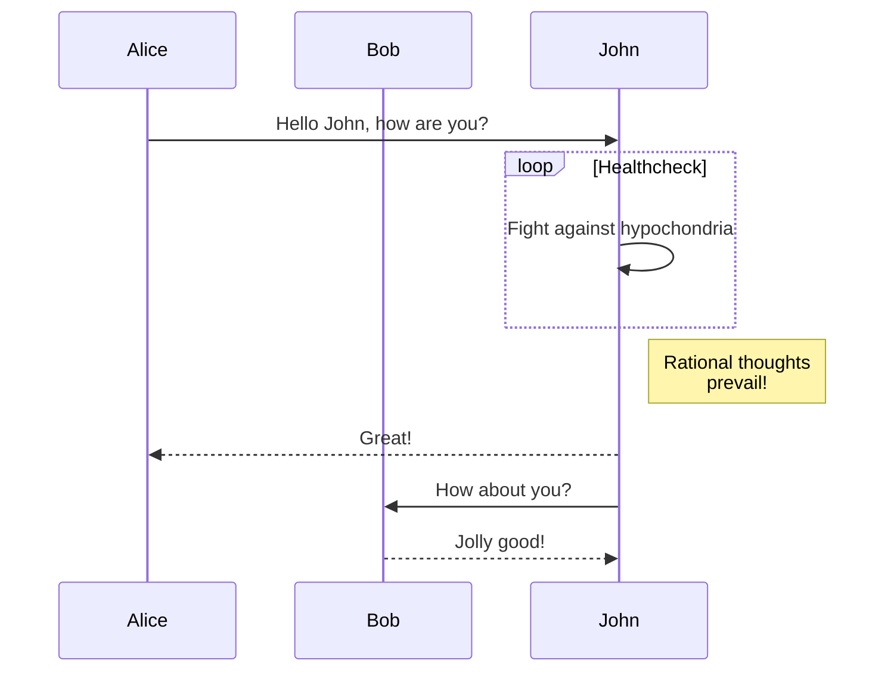

# Markdown
Markdown 
<div align="center">

# Markdown 完整语法指南

</div>

## 目录

- [基础语法](#基础语法)
- [标题](#标题)
- [段落与换行](#段落与换行)
- [强调](#强调)
- [列表](#列表)
- [链接](#链接)
- [图片](#图片)
- [引用](#引用)
- [代码](#代码)
- [分隔线](#分隔线)
- [表格](#表格)
- [任务列表](#任务列表)
- [删除线](#删除线)
- [脚注](#脚注)
- [HTML 标签](#html-标签)
- [转义字符](#转义字符)
- [数学公式](#数学公式)
- [流程图](#流程图)
- [Mermaid 图表](#mermaid-图表)

## 基础语法

Markdown 是一种轻量级标记语言，创建于 2004 年，目的是让文档更易于编写和阅读，同时还可以轻松转换为 HTML 和其他格式。

## 标题

使用 `#` 符号来创建标题，`#` 的数量表示标题的级别：

```markdown
# 一级标题
## 二级标题
### 三级标题
#### 四级标题
##### 五级标题
###### 六级标题
```

## 段落与换行

段落之间用一个或多个空行分隔：

```markdown
这是第一段。

这是第二段。
```

在行末添加两个或多个空格，然后按回车键，可以创建换行：

```markdown
这是第一行。  
这是第二行。
```

## 强调

### 斜体

```markdown
*斜体文本*
_斜体文本_
```

*斜体文本*

### 粗体

```markdown
**粗体文本**
__粗体文本__
```

**粗体文本**

### 粗斜体

```markdown
***粗斜体文本***
___粗斜体文本___
```

***粗斜体文本***

## 列表

### 无序列表

使用 `*`、`+` 或 `-` 创建无序列表：

```markdown
* 项目1
* 项目2
  * 子项目2.1
  * 子项目2.2

+ 项目1
+ 项目2

- 项目1
- 项目2
```

* 项目1
* 项目2
  * 子项目2.1
  * 子项目2.2

### 有序列表

使用数字加点创建有序列表：

```markdown
1. 项目1
2. 项目2
   1. 子项目2.1
   2. 子项目2.2
```

1. 项目1
2. 项目2
   1. 子项目2.1
   2. 子项目2.2

## 链接

### 基本链接

```markdown
[链接文本](URL)
```

[GitHub](https://github.com)

### 带标题的链接

```markdown
[链接文本](URL "标题")
```

[GitHub](https://github.com "GitHub 首页")

### 引用式链接

```markdown
[链接文本][标识符]

[标识符]: URL "可选标题"
```

[GitHub][1]

[1]: https://github.com "GitHub 首页"

### 自动链接

```markdown
<https://github.com>
<email@example.com>
```

<https://github.com>

## 图片

### 基本图片

```markdown

```

### 带标题的图片

```markdown

```

### 引用式图片

```markdown
![替代文本][标识符]

[标识符]: 图片URL "可选标题"
```

## 引用

使用 `>` 符号创建引用：

```markdown
> 这是一个引用。
> 
> 这是引用的第二段。
>> 这是嵌套引用。
```

> 这是一个引用。
> 
> 这是引用的第二段。
>> 这是嵌套引用。

## 代码

### 行内代码

使用反引号包裹代码：

```markdown
这是 `行内代码`。
```

这是 `行内代码`。

### 代码块

使用三个反引号或缩进四个空格创建代码块：

````markdown
```
function hello() {
  console.log("Hello, world!");
}
```
````

```
function hello() {
  console.log("Hello, world!");
}
```

### 语法高亮

指定编程语言以启用语法高亮：

````markdown
```javascript
function hello() {
  console.log("Hello, world!");
}
```
````

```javascript
function hello() {
  console.log("Hello, world!");
}
```

## 分隔线

使用三个或更多的 `-`、`*` 或 `_` 创建分隔线：

```markdown
---
***
___
```

---

## 表格

```markdown
| 表头1 | 表头2 | 表头3 |
|-------|-------|-------|
| 单元格1 | 单元格2 | 单元格3 |
| 单元格4 | 单元格5 | 单元格6 |
```

| 表头1 | 表头2 | 表头3 |
|-------|-------|-------|
| 单元格1 | 单元格2 | 单元格3 |
| 单元格4 | 单元格5 | 单元格6 |

### 对齐方式

使用 `:` 控制列的对齐方式：

```markdown
| 左对齐 | 居中对齐 | 右对齐 |
|:------|:-------:|------:|
| 文本 | 文本 | 文本 |
```

| 左对齐 | 居中对齐 | 右对齐 |
|:------|:-------:|------:|
| 文本 | 文本 | 文本 |

## 任务列表

```markdown
- [x] 已完成任务
- [ ] 未完成任务
- [ ] ~~取消的任务~~
```

- [x] 已完成任务
- [ ] 未完成任务
- [ ] ~~取消的任务~~

## 删除线

```markdown
~~删除的文本~~
```

~~删除的文本~~

## 脚注

```markdown
这里有一个脚注[^1]。

[^1]: 这是脚注的内容。
```

这里有一个脚注[^1]。

[^1]: 这是脚注的内容。

## HTML 标签

Markdown 支持嵌入 HTML 标签：

```markdown
<div align="center">
  <h1>居中标题</h1>
</div>

<span style="color:red">红色文本</span>
```

<div align="center">
  <h3>居中标题</h3>
</div>

<span style="color:red">红色文本</span>

## 转义字符

使用反斜杠 `\` 转义特殊字符：

```markdown
\* 这不是斜体 \*
```

\* 这不是斜体 \*

可以转义的字符：
```
\ 反斜杠
` 反引号
* 星号
_ 下划线
{} 花括号
[] 方括号
() 小括号
# 井号
+ 加号
- 减号
. 点
! 感叹号
```

## 数学公式

许多 Markdown 编辑器支持 LaTeX 数学公式：

### 行内公式

```markdown
$E=mc^2$
```

$E=mc^2$

### 块级公式

```markdown
$$
\frac{n!}{k!(n-k)!} = \binom{n}{k}
$$
```

$$
\frac{n!}{k!(n-k)!} = \binom{n}{k}
$$

## 流程图

一些 Markdown 编辑器支持流程图（如 Mermaid）：

````markdown
```flow
st=>start: 开始
op=>operation: 操作
cond=>condition: 是否继续？
e=>end: 结束

st->op->cond
cond(yes)->op
cond(no)->e
```
````

## Mermaid 图表

许多 Markdown 编辑器支持 Mermaid 图表：

````markdown

````


````markdown

````


---

<div align="center">

**Markdown 让文档编写变得简单而强大！**

</div>
